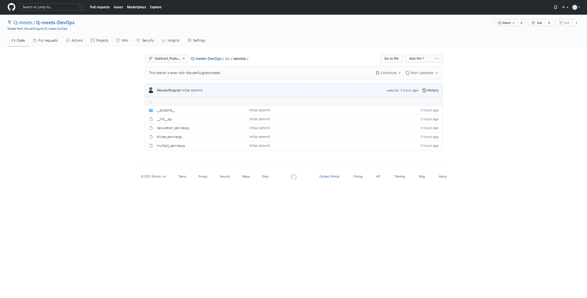
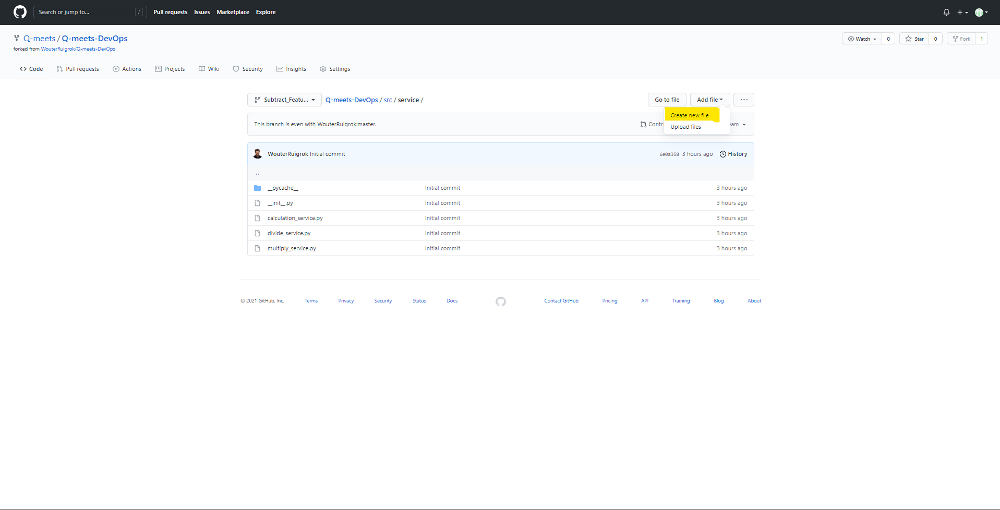
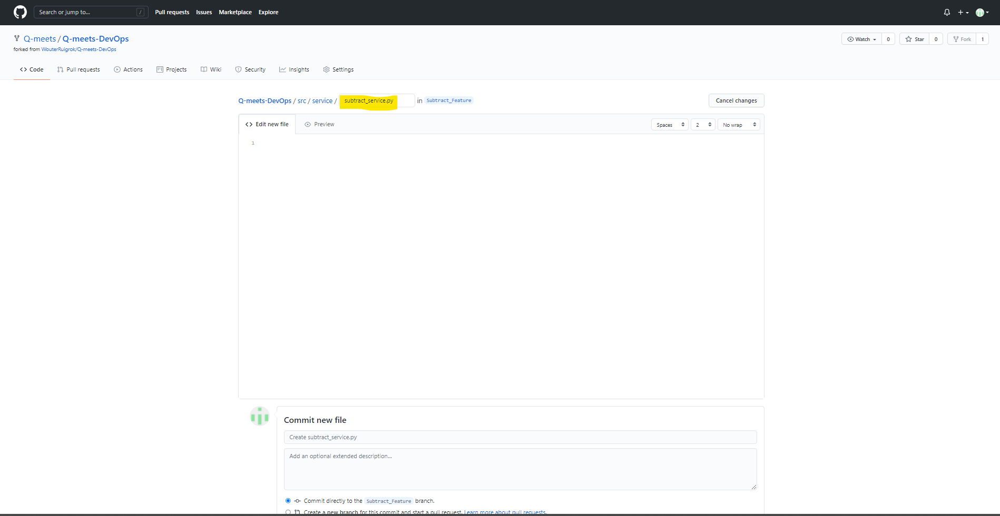
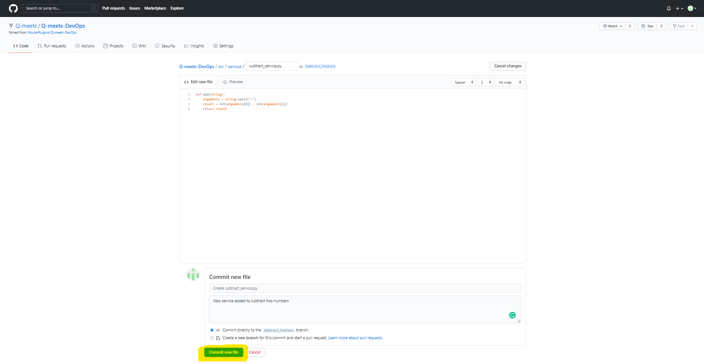
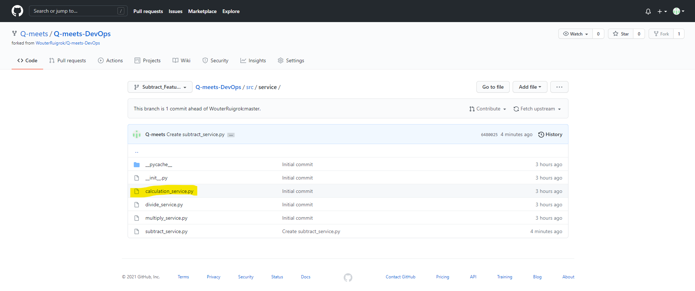
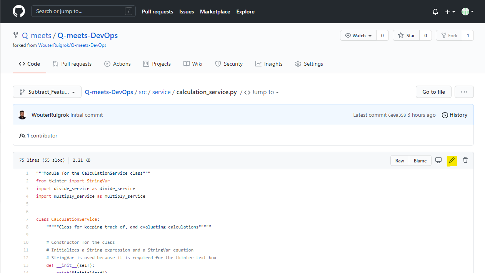
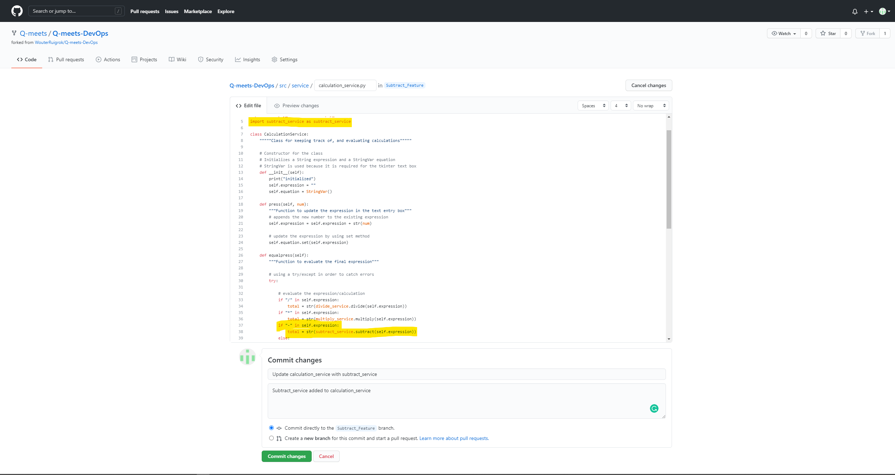

[<< Back - Set up your branch](set_up_branch.md)
## Adding a new feature
The next steps will guide you trough the process of adding a new feature to a calculator application.
#### Adding the subtract service
For the calculator to be able to subtract two numbers we need to create a subtract service. Go to the service folder in "src". You can do this by clicking on the folders on the page or by **adding**: "/tree/Subtract_Feature/src/service" to the URL in your browser.


Your page should like like the above picture.


Next step is to add a new file by selecting "Create new file" in top right corner "Add file" menu.


Name your file: "subtract_service.py". Add the following code to the content of the file.
```python:
def add(string):
    arguments = string.split("-")
    result = int(arguments[0]) - int(arguments[1])
    return result
```


After adding the code to the file add a desciption to the commit at the bottom of the page. When a description is added click on "Commit new file".

#### Updating the calculation service
We now have created a new service. To make use of this service we need to make a reference in the main service. The following steps will add this reference to the main calculation service.


Open the calculation service by clicking on the "calculation_service.py" link.


After the file opens click on "edit file". Add the following lines of code to the file.

On line 5:
```python:
import subtract_service as subtract_service
```

On line 37:
```python:
if "-" in self.expression:
                total = str(subtract_service.subtract(self.expression))
```


After adding the new lines of code add a commit messages and summary and commit the change.

[Merging the feature using a pull request - Next >>](merging_a_feature.md)