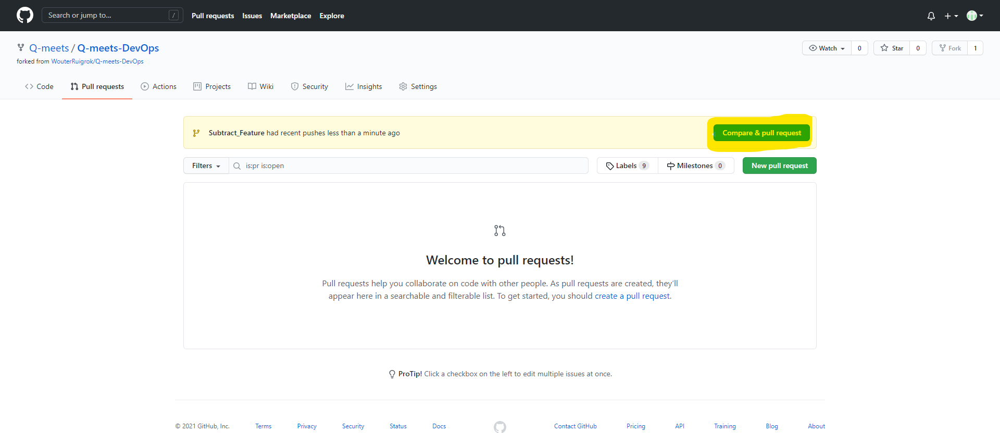
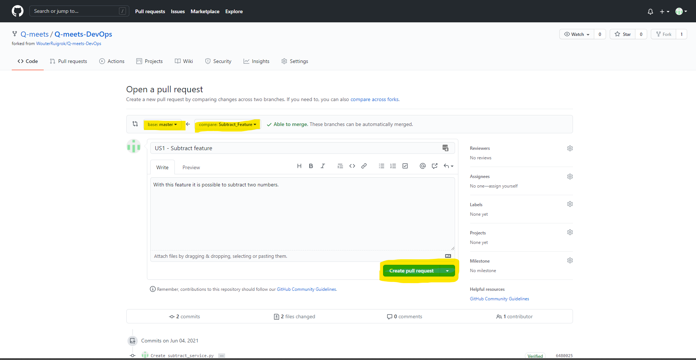
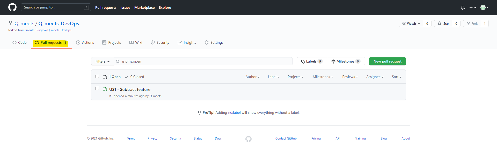
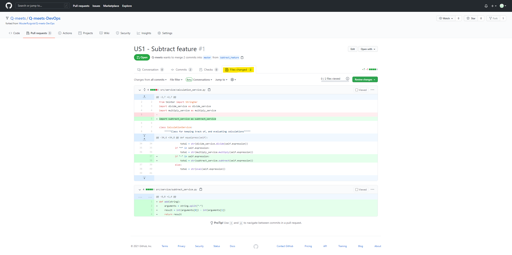
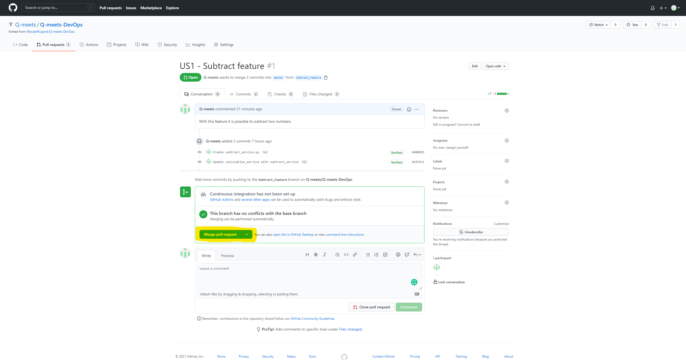

## Merging the feature using a pull request
The steps so far where to create a code change which we can use for creating a pull request. The following steps will guide you in creating this request and accepting one to merge te code change.
#### Setting up a pull request

Open the tab "Pull requests" on the top left of the page. On the Pull request page click on the button "Compare & pull request".
There you can name your pull request and add a description. You can add a reference to the backlog item in the name for tracebillity. Before you create the pull request check that the correct repository is chosen. You should have your own repository on both sides (as shown in the picture below). Finalize the request by clicking on the button "Create pull request"

#### Reviewing a pull request
**N.B. The following steps are normally done by another team member but for this exercise we will do it ourselves.**

Click again on the "Pull request" tab to see all open pull requests.

You should now see your previously created pull request in the list (there is only one at the moment). By clicking on the name of the pull request you will see the details.
When opening the "Files changed" tab you will see all the modifications made related to this pull request.

When lines are removed from the file they will be marked red. Newly added lines are marked green. Unchanged block are blue.
When reviewing the changes it is possible to add comments, general comments can be done in the "Conversation" tab. It is also possible to place a comment on a specific line of code.

#### Merging the open pull request
When the changes is approved you can merge the open request.

When merging the pull request you can add an optional comment.

Your new feature is now part of the main branch and integrated into the product. **Congratulations!**

[<< Back - Adding a new feature](adding_a_feature.md)[Group assignment - Next >>](group_assignment.md)