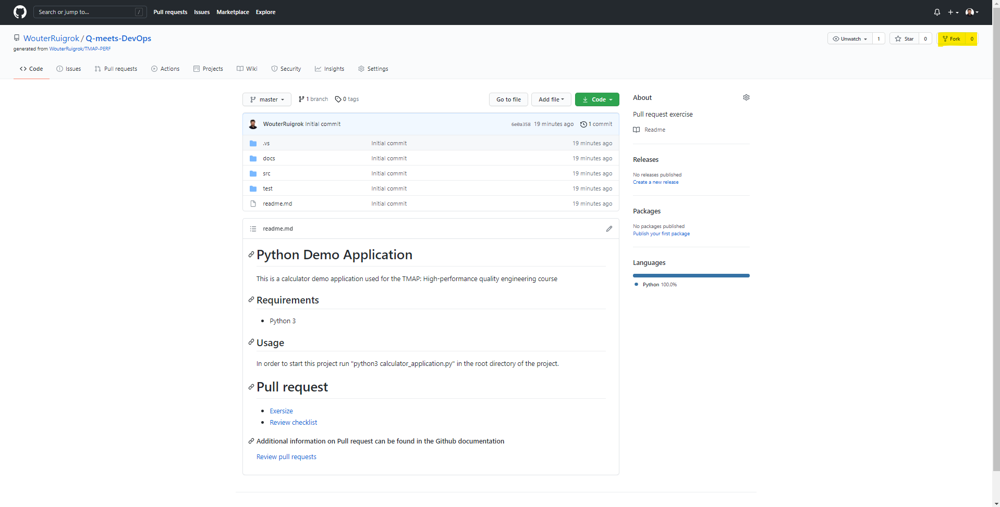
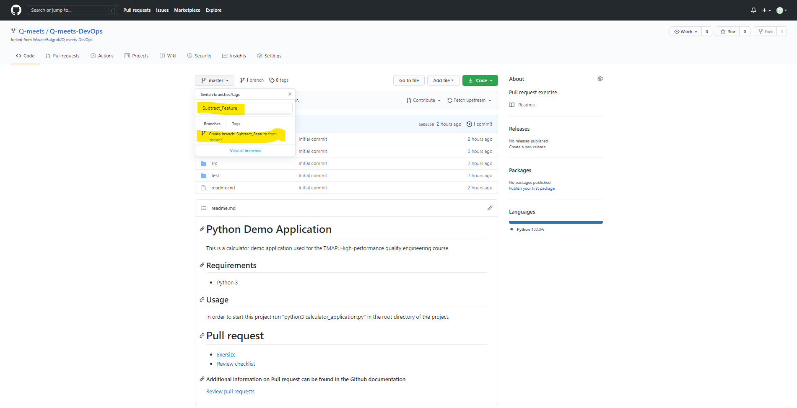
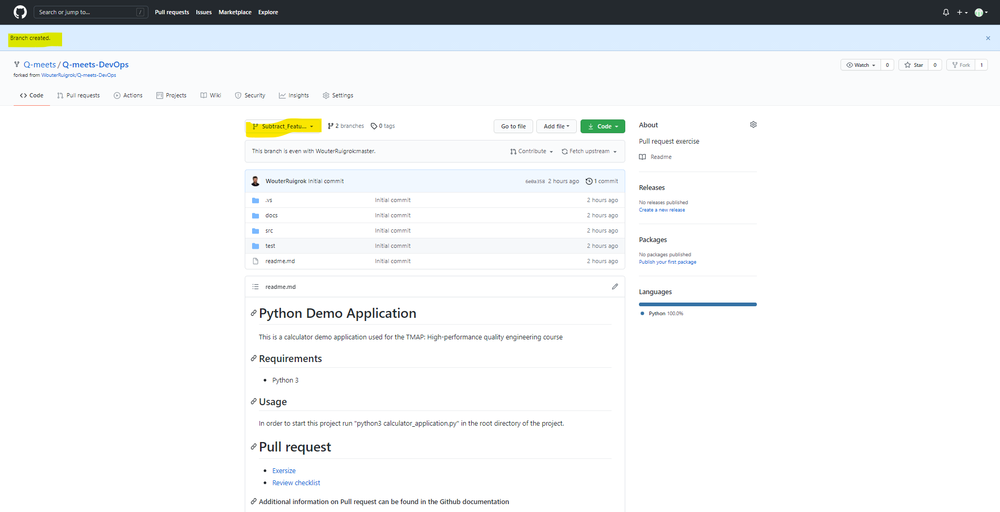

## Set up your branch
#### Create a GitHub account
Before you can fork a repository you need an GitHub account. If you allready have an account you can skip this step.
Create an account can be done on the GitHub website. 

[Create account](https://github.com/join?ref_cta=Sign+up&ref_loc=header+logged+out&ref_page=%2F&source=header-home){:target="_blank"} 

Follow the steps indicated on the site. For extra info you can watch the following video:

<iframe width="560" height="315" src="https://www.youtube.com/embed/az17G21pmQs" title="YouTube video player" frameborder="0" allow="accelerometer; autoplay; clipboard-write; encrypted-media; gyroscope; picture-in-picture" allowfullscreen></iframe>

#### Create a fork from the source
When you are logged in go to the source:

https://github.com/Q-meets/Q-meets-DevOps

Click on the "Fork" button in the right top corner of the site. After confirmation you have a personal copy of the original source. In this way you can create changes to the code without effecting the original.
#### Create a feature branch
When you want to start working on a new feature or story it is advised to create a feature branch. This enables working with multiple people on the same product.

When on the main page click on the "master" dropdown. Fill in the tekst field "Subtract_Feature". This will be the name of the branch you create. We pick a name here that referes to te feature we are going to implement.
After filling in the name click on "**Create branch: Subtract_Feature** from 'master'".

Your feature branch is now created!

[<< Back - Intro](Q_meets_DevOps.md) [Adding a new feature - Next >>](adding_a_feature.md)